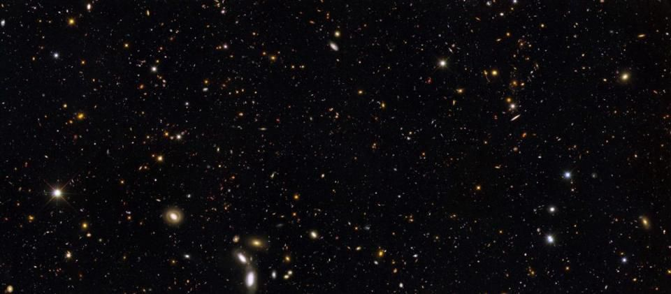

# Background Remove/Replace from Image

The following app demonstrates the usecase of [DeepLab v3](https://github.com/tensorflow/models/tree/master/research/deeplab) in pytorch for removing background of images.

If you want to look at the actual bare code you can check the [DeepLabv3.ipynb](DeepLabv3.ipynb)

If you want to view a UI implementation in Streamlit clone the repo and install all the dependencies from the `requiremets.txt`. Once you have installed all the dependencies run the following command `streamlit run App.py`

---

### Sample Ouput:
| Input | Replace Background | Output |
|:---:  |        :---:       | :---: |
|  |  |  |
|  | **None** |  |

---
### References:
[Learn OpenCV](https://learnopencv.com/applications-of-foreground-background-separation-with-semantic-segmentation/)